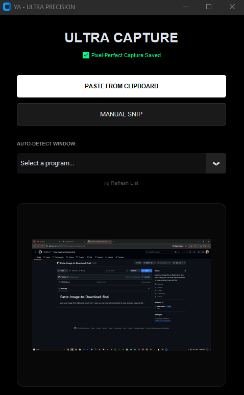
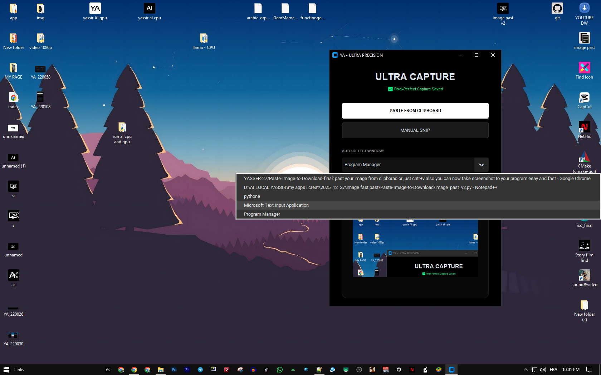
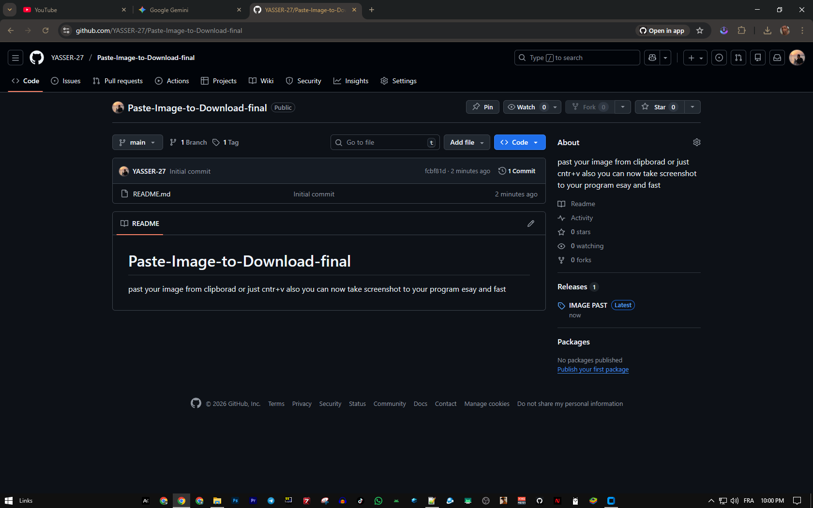

# Paste-Image-to-Download-final
past your image from clipborad or just cntr+v also you can now take screenshot to your program esay and fast
# [ app like ]

# [ app like ]
---

# [ screen from app ]
---

